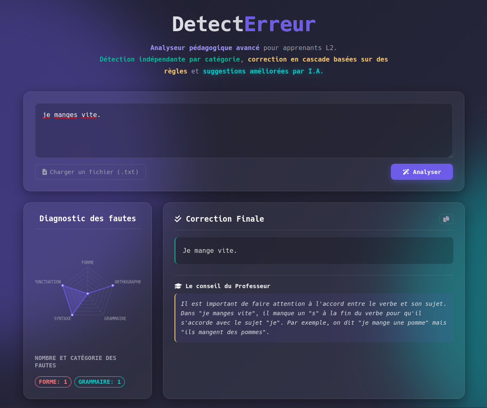

# DetectErreur System 🇫🇷

**DetectErreur System** is an educational web application designed to assist L2 learners of French. It combines **deterministic rule-based algorithms** (via the `detecterreur` library) for precise error detection with **Generative AI** (Mistral-Nemo) for contextual correction and pedagogical advice strictly grounded in grammar rules.



---

## ✨ Features

* **🔍 Hybrid Analysis**:
* **Deterministic**: Uses `detecterreur` and `spaCy` to identify specific error categories (Form, Orthography, Grammar, Syntax, Punctuation).
* **AI-Enhanced**: Uses `Mistral-Nemo` via Ollama for contextual refinement and advice.


* **📊 Visual Diagnostics**: Interactive Radar Chart (Spider Graph) visualizing the learner's strengths and weaknesses.
* **🧠 RAG-Based Pedagogy**: The AI advice is generated using **Retrieval Augmented Generation**. It is strictly constrained to the rules defined in `resources/french_grammar_rules_final.txt`, preventing hallucinations.
* **⚡ Real-Time & Lazy Loading**: Asynchronous architecture ensures the visual diagnostic appears immediately, while the AI correction and advice load in the background.
* **🎨 Modern UI**: A responsive Glassmorphism interface with smooth animations and skeleton loaders.

---

## 🚀 Installation & Setup

### 1. Prerequisites

* **Python 3.12+**
* **uv** (Python package manager)
* **Ollama** (Local LLM runner)

### 2. Environment Setup

Clone the repository and sync dependencies using `uv`:

```bash
# Install dependencies
uv sync

# Activate the virtual environment
source .venv/bin/activate

```

### 3. Install Language Models

You need the French spaCy model and the Mistral-Nemo LLM model.

```bash
# 1. Download spaCy French model
uv run python -m spacy download fr_core_news_sm

# 2. Pull the LLM model via Ollama
ollama pull mistral-nemo

```

*Note: Ensure Ollama is running in the background (`ollama serve`).*

---

## 🏃‍♂️ Usage

### 1. Start the Backend API

Run the FastAPI server using `uvicorn`. The application is configured to run on port `32768`.

```bash
uvicorn src.api.main:app --host 0.0.0.0 --port 32768 --reload

```

* **API Docs:** Available at `http://localhost:32768/docs`
* **LLM Connection:** The backend expects Ollama to be listening at `http://localhost:11434`.

### 2. Launch the Frontend

Simply open the `src/website/index.html` file in your web browser.

* You can double-click the file.
* Or serve it using a simple python server: `python -m http.server 8000 --directory src/website`

---

## ⚙️ Configuration

### The Grammar "Bible"

The file `resources/french_grammar_rules_final.txt` acts as the **Source of Truth** for the AI.

* The system loads this file into the context window.
* The prompt instructs the LLM to **only** give advice based on rules found in this file.
* You can edit this file to add new rules or change the pedagogical focus.

### Port Configuration

The frontend `index.html` is hardcoded to communicate with:
`const API_URL = "http://91.169.47.129:32768/api";`

* **Local Development:** If running locally, change this line in `index.html` to:
`const API_URL = "http://localhost:32768/api";`
* **Production/Remote:** Ensure the IP matches your server's public IP.

---

## 🛠 Tech Stack

* **Backend:** FastAPI, Uvicorn, Aiohttp
* **NLP & Logic:** `detecterreur`, `spaCy`
* **AI/LLM:** Ollama, Mistral-Nemo
* **Frontend:** HTML5, CSS3 (Glassmorphism), Vanilla JS, Chart.js

---

## 📝 License

MIT License. Created for the Unsupervised Learning School Project.
